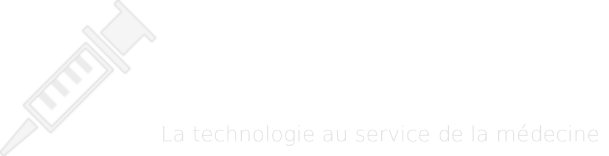

## 🌍 Versiones multilingües del README

- 🇫🇷 [Francés](./README.fr.md)
- 🇬🇧 [Inglés](./README.md)
- 🇪🇸 [Español (estás aquí)](#)

## 📘 Descripción del proyecto

Este proyecto es mi **primer sitio web**, realizado en **2015** durante mi **primer año del BUT en Informática** en el **IUT de Montreuil**, como parte de un trabajo en grupo.

🎯 **Objetivo educativo:**
- Escribir **al menos dos artículos cada uno** sobre un tema elegido
- **Citar las fuentes** utilizadas
- Diseñar un **sitio web** para presentar los artículos

🔗 **Sitio web**: [👉 Ver el sitio](https://fab16bsb.github.io/KerMTech/)

---

### 📁 Estructura del proyecto

- `index.html`: página de inicio
- `pages/`: carpeta con las diferentes páginas del sitio
- `style.css`: hoja de estilo personalizada
- `img/`: ilustraciones
- `font/`: fuentes tipográficas

---

### 🧑‍💻 Tecnologías utilizadas

- HTML5  
- CSS3  
- JavaScript  
- Alojado en **GitHub Pages**

---

## ⚙️ Funcionalidades

- Sitio estático programado en **HTML, CSS con animaciones JavaScript**
- Presentación de **varios artículos temáticos**
- Navegación entre artículos
- 📌 **Sitio disponible solo en francés**
- 🖥️ **Diseñado solo para computadoras de escritorio** (no es responsive, no está optimizado para móviles)

---

## 🧑‍💻 Autores

- [Boris ENG] (autor de la sección “Ayuda a la decisión”)
- [Kostia CHARDONNET] (autor de la sección “Nanomedicina”)

---

### 🙌 Agradecimientos

Gracias al equipo docente del IUT de Montreuil por su orientación y apoyo durante el proyecto.
